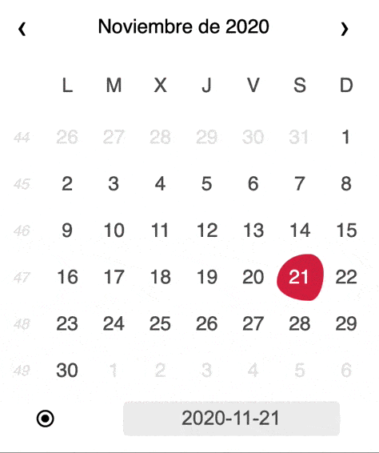

# DatePickerJS
DatePickerJS is a lightweigth calendar shaped WebComponent written in pure JS that uses [Luxon](https://moment.github.io/luxon/) ([MomentJS successor?](https://momentjs.com/docs/)) for date management.

## Why do I have created this?

For a work project, I needed a calendar shaped control for web and most of the components I found on the web were usign jQuery or didn't suit my needs. So I created this one.



Tips:
- After write the date on the input, press <kbd>tab</kbd> or <kbd>enter</kbd>.
- To select a range of dates hold <kbd>shift</kbd> for the second click.

## How to install

If you don't have Luxon in your project add this just above `</body>` tag:
```
<script src="js/luxon.min.js"></script>
<script src="js/calendar.component.js"></script>
```
Else just add the reference to `calendar.component.js`:
```
<script src="js/calendar.component.js"></script>
```

## How to use

1. Include on your html:
```
<datepicker-js></datepicker-js>
```

2. Get its reference from JS:
```
let datepicker = document.querySelector('datepicker-js');
```

3. Use its functions:  
**Calendar View:**
    - Show specific month programatically
      ```
      datepicker.setDate(date: luxon.DateTime);
      ```
    - Show previous/next month:
      ```
      datepicker.showPrevMonth();
      datepicker.showNextMonth();
      ```
    - Show previous/next year:
      ```
      datepicker.showPrevYear();
      datepicker.showNextYear();
      ```
    
    - Set selected date/dates programmatically:
      ```
      datepicker.selectedDates(from: luxon.DateTime, to: luxon.DateTime)    ;
      ```
    **Selected Dates:**
    - Get selected dates:  
    _It will return `null` if there's no date selected, else it will return:_
      ```
      {from: luxon.DateTime, to: luxon.DateTime}
      ```
      ```
      datepicker.selectedDates();
      ```
    **Internationalization:**
    - Set locale:  
      ```
      datepicker.setLocale(localeTwoChars: string);
      ```

## Bugs and Suggestions (🐛📝)
- Contact me by twitter [@sergidb](https://twitter.com/sergidome)

## Thanks
- Luxon: https://moment.github.io/luxon/